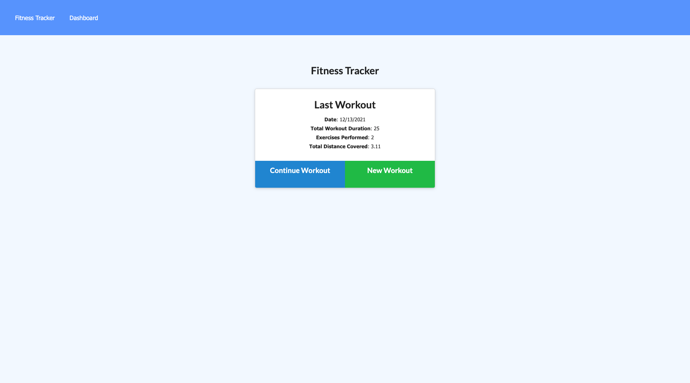
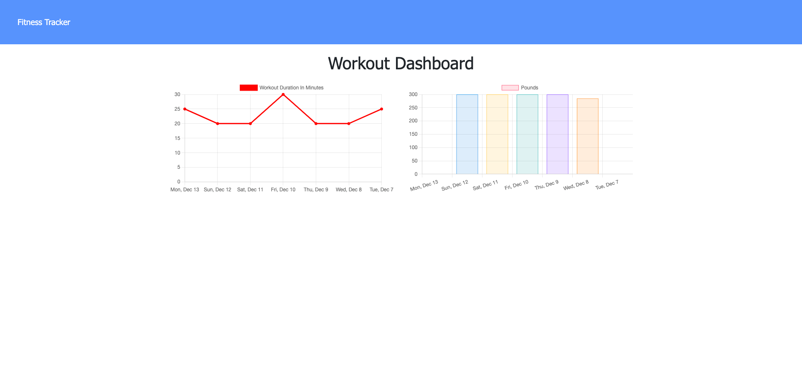

# workout-tracker

[](https://opensource.org/licenses/MIT)

## Description

I created this application to give end users the capability to view, create, and track daily workouts. You can even log more than one exercise within a single workout. You can track each exercise's name, type, weight, sets, reps, and duration. If the exercise is cardio, you can track the distance traveled and duration as well. This web application helps end users reach their fitness goals more quickly and helps them keep up with their routine.

## Table of Contents

- [Description](#description)
- [Installation](#installation)
- [Usage](#usage)
- [Screenshots](#screenshots)
- [Deployed Application](#deployed-application)
- [License](#license)
- [Tests](#tests)
- [Questions](#questions)

## Installation

To install necessary dependencies, please run the following command:

```
npm install
```

## Usage

From the homepage, you will select Continue or New Workout to add an exercise. You can navigate to the Dashboard to see an overview of your last 7 workouts by total duration and pounds for resistance workouts.

## Screenshots





## Deployed-Application

[Link to deployed application](https://workout-tracker-mongodb-app.herokuapp.com/)

## License

This project is covered under the MIT license. Visit the following link for more information on this license: [MIT](https://opensource.org/licenses/MIT)

## Questions

For any questions about the project, please contact me by either of the following links:

- Email - jordan.dubose1@gmail.com

or visit my GitHub profile:

- GitHub - [jordandub1](https://github.com/jordandub1)
